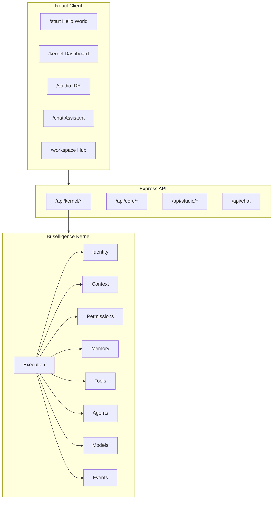
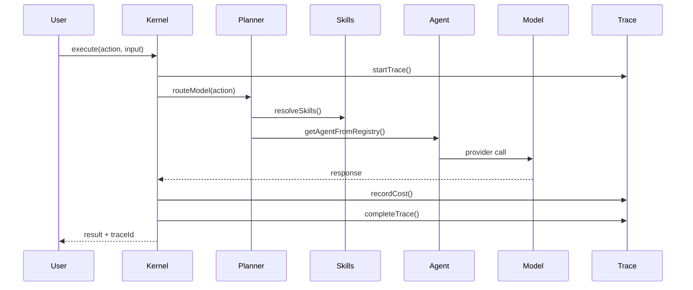
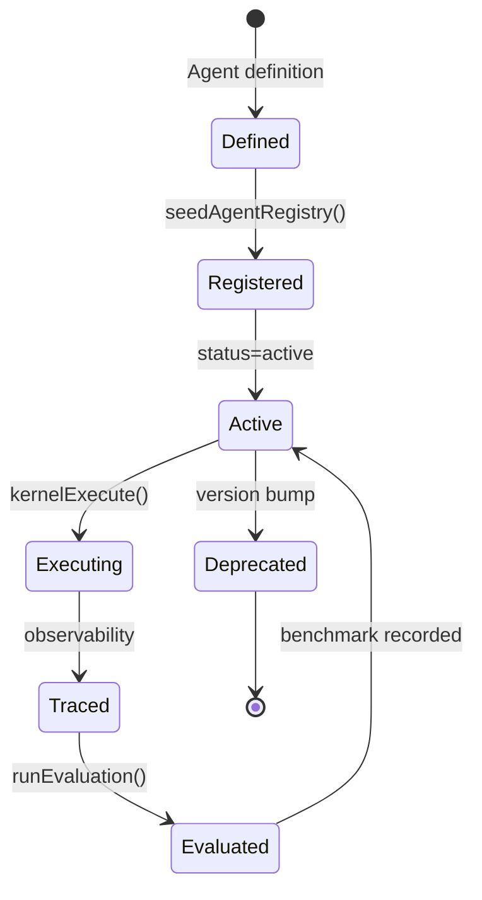
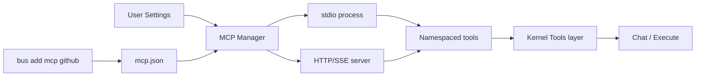
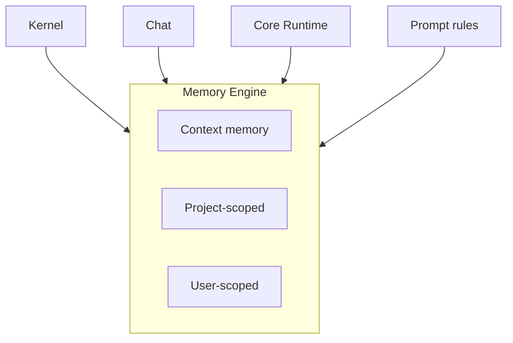
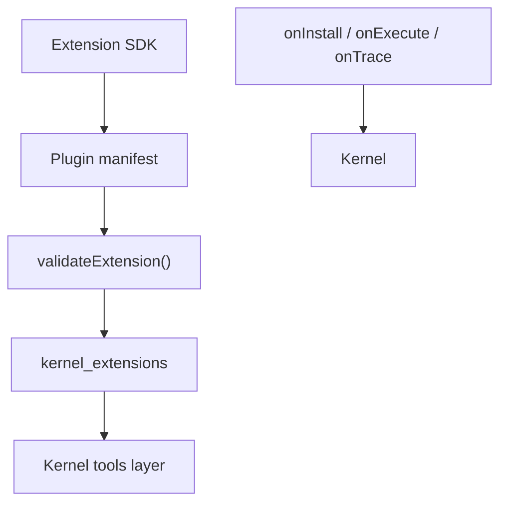

# Buselligence Architecture (v8)

The open-source runtime for building, running, and extending AI-powered applications.

## Runtime architecture

## Kernel execution flow

## Agent lifecycle

## MCP flow

## Memory architecture

## Plugin system

## Stack

| Layer | Technology |
|-------|------------|
| Frontend | React, Vite, TypeScript, Tailwind |
| Backend | Express 5, TypeScript |
| Database | SQLite (better-sqlite3) |
| Auth | BetterAuth |
| AI | OpenAI, Anthropic, Google, local |
| Protocol | MCP (Model Context Protocol) |
| CLI | Node.js, TypeScript |

## Frontend routes

| Route | Purpose |
|-------|---------|
| `/start` | Hello World — 60-second onboarding |
| `/why` | Why Buselligence |
| `/kernel` | Kernel dashboard |
| `/core` | AI Operating Layer |
| `/workspace` | AI workspace hub |
| `/studio` | Developer studio |
| `/chat` | Universal assistant |
| `/platform` | Data intelligence |
| `/settings` | BYOK, MCP |

## Database

Kernel tables: `kernel_skills`, `kernel_agent_registry`, `kernel_evaluations`, `kernel_prompts`, `kernel_traces`, `kernel_costs`, `kernel_lockfiles`, `kernel_extensions`, `kernel_community_items`.

See [KERNEL.md](./KERNEL.md) for API reference.

## Extension points

| Area | How to extend |
|------|---------------|
| Skills | Add to `kernel/skills.ts` or community |
| Agents | `agents/definitions.ts` + registry |
| MCP | Settings UI or `bus add mcp` |
| Plugins | Extension SDK |
| CLI templates | `cli/src/lib/templates.ts` |
| Examples | `examples/` directory |

## Production

See [DEPLOYMENT.md](./DEPLOYMENT.md).
